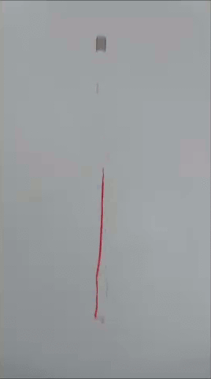

###Kite Wind Speed Meter
The goal of this project is measure wind speed at altitude using kites themselves as sensors. By measuring the tension on a kite line and other factors measurements of wind speed, direction, and turbulence can be extrapolated.

This repository is for kite designs, measurement tools, analysis techniques, and software necessary to use kites as anemometers (wind speed meters). 

It is a project of [Public Lab](www.publiclab.org) to [collect ongoing research into kite anemometers](www.publiclab.org/tag/kite-anemometer) as stable open hardware designs licensed under the [CERN OHL 1.2](http://www.ohwr.org/attachments/2388/cern_ohl_v_1_2.txt). 

###Current Work
Current work focuses on replicating the [TALA](/TALA) (Tethered Aerodynamic Lifting Anemometer) by Approach Fish, an out-of-production and out-of-patent (US4152933) kite wind speed meter in the public domain. 

###Resources
coming soon. a bibliography of resources on kite anemometry